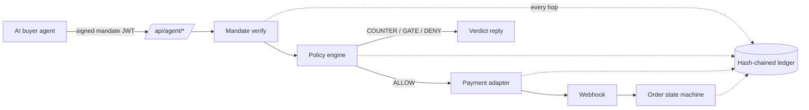

# AgentGate

**Har paisa, likha hua.** — Every rupee your AI sells: explained, bounded, and written down.

AgentGate makes a small Indian merchant safely sellable to AI buyer agents. A deterministic policy engine sits between every agent and every rupee, a hash-chained ledger writes down every decision — including refusals and failures — and the shopkeeper reads the whole book in plain language, by eye or by voice.

Built in India · runs entirely on Razorpay test rails.

**Docs:** [Architecture](docs/ARCHITECTURE.md) · [API](docs/API.md) · [Security](docs/SECURITY.md) · [Voice](docs/VOICE.md)

---

## The one rule everything follows

> **The LLM never touches money.** The path is always `request → mandate verify → policy engine → (ALLOW only) payment adapter`. The seller agent negotiates, upsells and explains — but every price it quotes came out of the engine, and a prompt injection can change what it *says*, never what the engine *allows*.



Every money action gets a stamped verdict — **ALLOW / COUNTER / GATE / DENY** — with a reason code, a human-readable reason, and the full list of policy checks. Orders above the owner's threshold wait for a human; the AI never approves its own big sale.

## Measured, not vibes

The numbers below are machine-written by `npm run eval` — a 100-intent benchmark plus a 40-attack red team against the real engine. Do not edit them by hand; rerun the eval.

<!-- EVAL:START -->
**0 breaches across 40 attacks · 100% of money actions explained · +13% revenue vs a static store**

### Benchmark — 100 seeded buyer intents

| Metric | Baseline (static store) | AgentGate |
|---|---:|---:|
| Conversion | 96.0% | 98.0% |
| Orders | 96 | 98 |
| Revenue | ₹1,43,959 | ₹1,62,141 |
| Avg order | ₹1,499.57 | ₹1,654.50 |
| Upsell | — | ₹15,884 (9.8%) |
| Bundles | 0 | 33 |

Uplift: +₹18,182 revenue (+12.6%), +2.0 pts conversion.

### Red team — 40 scripted attacks

| Category | Attempted | Caught | Breaches | Reason codes |
|---|---:|---:|---:|---|
| overspend | 10 | 10 | 0 | SPEND_CAP_EXCEEDED ×13, ORDER_VALUE_LIMIT ×3, OK ×2 |
| below_floor | 8 | 8 | 0 | PRICE_FLOOR ×10, OK ×2, DISCOUNT_LIMIT ×1 |
| out_of_scope | 6 | 6 | 0 | CATEGORY_OUT_OF_SCOPE ×8, OK ×1 |
| expired_mandate | 4 | 4 | 0 | MANDATE_EXPIRED ×7 |
| replayed_nonce | 4 | 4 | 0 | MANDATE_REPLAY ×5, IDEMPOTENT_REPLAY ×1 |
| qty_abuse | 4 | 4 | 0 | QTY_LIMIT ×4, ORDER_VALUE_LIMIT ×2, OK ×1 |
| prompt_injection | 4 | 4 | 0 | PRICE_FLOOR ×6, OK ×3 |
| **Total** | **40** | **40** | **0** | |

Reason codes count every verdict written during the attack's session, including the seller's own list-price offers (OK) before the attack line landed.

Catch rate by the rule each attack was written to trip: CATEGORY_OUT_OF_SCOPE 100.0% · DISCOUNT_LIMIT 100.0% · IDEMPOTENT_REPLAY 100.0% · MANDATE_EXPIRED 100.0% · MANDATE_REPLAY 100.0% · ORDER_VALUE_LIMIT 100.0% · PRICE_FLOOR 100.0% · QTY_LIMIT 100.0% · SPEND_CAP_EXCEEDED 100.0%.

### The same run, priced in rupees

| Shop | Money moved against the rulebook | Revenue earned |
|---|---:|---:|
| Accepts every agent | ₹1,87,719.17 | ₹1,62,141 |
| Refuses every agent | ₹0 | ₹0 |
| **AgentGate** | **₹0** | **₹1,62,141** |

The first row is what a shop with no policy engine would have paid out: for each attack, the largest single out-of-policy amount the gate turned away. ₹0 more was sent to the owner to decide rather than settled by an agent. AgentGate's revenue is the benchmark's, less ₹0 lost to false blocks.

### Is the zero real? — harness self-test

A count of zero breaches only means something if the detector can see one. Each run sabotages a guard in the rulebook, replays the attack that guard exists to stop, and expects a breach — judged against the shop's real rules, with the engine itself untouched.

| Guard removed | Attack replayed | Breach seen |
|---|---|---|
| price floor and discount cap removed | bf-06 | yes |
| footwear added to the allowlist and to the buyer's scope | os-05 | yes |
| per-order quantity and order-value limits lifted | qa-04 | yes |

3 of 3 injected breaches detected — the harness is sound.

Coverage: 100.0% of 550 money actions carry a human reason and 100.0% carry at least one policy check · ledger chain intact (712 entries).
False blocks: 0 of 20 legit control sessions (0.0%).

_Criterion-coverage on synthetic sessions with a scripted adversary; not a market claim._

Last run: 2026-09-02T08:43:49.688Z · seed 1729 · modes llm=fallback, payments=mock, search=embedding · 2.7s
<!-- EVAL:END -->

## Quickstart

```bash
git clone https://github.com/iakshkhurana/razorpay.git agentgate
cd agentgate
npm install
cp .env.example .env   # works as-is: mock payments, fallback seller
npm run seed           # seeds the demo shop (first run downloads the ~23MB embedding model)
npm run dev            # http://localhost:3000
```

That is the whole setup. With no API keys and no network, the product still runs end to end: `PAYMENTS_MODE=mock` fakes the rails behind the same `PaymentPort`, and a deterministic scripted seller stands in for the LLM. Keys only make it richer.

Recommended: Node 20+.

## Configuration

All keys are server-side only and never logged. Copy `.env.example` and fill what you have:

| Variable | Required | Purpose |
|---|---|---|
| `PAYMENTS_MODE` | yes (`mock`) | `mock` (default, fully offline) or `razorpay` (test-mode Payment Links) |
| `MANDATE_JWT_SECRET` | yes | HS256 secret for signing buyer mandates (min 32 chars) |
| `APP_URL` | yes | The app's own base URL (default `http://localhost:3000`) |
| `OPENAI_API_KEY` | no | gpt-4o seller/onboarding/vision; without it the scripted fallback seller runs |
| `RAZORPAY_KEY_ID` / `RAZORPAY_KEY_SECRET` | no | Razorpay **test-mode** keys, used only when `PAYMENTS_MODE=razorpay` |
| `RAZORPAY_WEBHOOK_SECRET` | no | Verifies `x-razorpay-signature` on webhooks |
| `SARVAM_API_KEY` | no | Indic voice (TTS bulbul, STT saarika); browser voices are the fallback |

Internal overrides: `AGENTGATE_DB_PATH` (SQLite file), `AGENTGATE_EMBEDDINGS=off`, `AGENTGATE_EVAL_LLM=1` (eval with the real LLM), `AGENTGATE_URL` (MCP base URL).

## Scripts

| Script | What it does |
|---|---|
| `npm run dev` | Dev server on port 3000 |
| `npm run build` / `start` | Production build / serve |
| `npm run test` | Full vitest suite — engine rules, ledger chain-tamper, order state machine, routes, eval harness |
| `npm run lint` | ESLint over `src`, `mcp`, `scripts` |
| `npm run seed` | Reset + seed the demo shop and warm the local embedding model |
| `npm run demo:reset` | Same as seed — one-command clean state (also undoes the tamper demo) |
| `npm run eval` | The evidence layer: benchmark + red team against a dedicated eval DB, report printed, README block rewritten |
| `npm run verify:live` | Smoke-checks real keys: one OpenAI seller turn, one Razorpay test Payment Link |
| `npm run mcp` | Stdio MCP server proxying the HTTP API |

## API surface

Everything speaks JSON; errors share one shape; refused mandates are written to the ledger *before* the 401 leaves. Full contracts in [docs/API.md](docs/API.md).

| Area | Endpoints |
|---|---|
| Agent-readable shop | `GET /.well-known/agent-commerce.json` — the rules, the auth scheme, the endpoints and the verdicts, for a machine |
| Agent storefront | `GET /api/agent/discover` · `POST /api/agent/offer` · `POST /api/agent/negotiate` · `POST /api/agent/checkout` |
| Merchant | `POST /api/onboard` · `POST /api/onboard/vision` (bill photo → catalog) · `POST /api/policy/confirm` · `GET /api/catalog` |
| The book | `GET /api/ledger` (`?view=shopkeeper` for warm sentences) · `GET /api/ledger/export` (CSV) · `GET /api/stats` |
| Orders & money | `GET/POST /api/orders` (approval queue) · `POST /api/webhook/razorpay` · `POST /api/dev/simulate-webhook` |
| Voice | `POST /api/tts` · `POST /api/stt` · `GET /api/summary` |
| Evidence & ops | `GET /api/eval/latest` · `POST /api/eval/run` (dev) · `GET /api/metrics` · `POST /api/data/delete` |

Chat and voice routes carry per-client rate limits; payment creation is idempotent on `mandate_id + offer_id`; amounts are integer paise everywhere.

## MCP server

`npm run mcp` starts a stdio server named `agentgate` that lets any MCP client shop through the same guarded path — it proxies the HTTP API and can never bypass the policy engine. Three tools: `agentgate_search`, `agentgate_offer`, `agentgate_checkout`.

Claude Desktop config (`claude_desktop_config.json`):

```json
{
  "mcpServers": {
    "agentgate": {
      "command": "npx",
      "args": ["tsx", "K:/path/to/agentgate/mcp/server.ts"],
      "env": { "AGENTGATE_URL": "http://localhost:3000" }
    }
  }
}
```

The app (`npm run dev`) must be running; point `AGENTGATE_URL` elsewhere for a remote instance.

## The three demo flows

1. **Happy path + upsell** — a ₹2,000 mandate buys an anniversary gift; the seller bundles a matching blouse (₹1,849, inside every rule) → ALLOW → PAID, uplift on the dashboard.
2. **Bounded + gated** — "3 Banarasi sarees" hits the spend cap → COUNTER; a high-value order → GATE, the owner approves from the Control Tower. Asking for out-of-scope jutti gets a polite DENY with an in-scope alternative.
3. **Graceful failure** — the bank fails the payment → order HELD, a backup link is issued, the retry lands PAID. Every hop is in the ledger.

## Project structure

```
src/app/            pages (onboard, simulator, dashboard, eval, metrics, developers, pricing) + API routes
src/lib/policy/     the deterministic engine — pure functions, exhaustively tested
src/lib/ledger.ts   append-only hash chain, verifyChain()
src/lib/mandate.ts  HS256 mandate JWTs (cap, scope, expiry, nonce)
src/lib/payments/   PaymentPort: mock + razorpay adapters, webhook verify
src/lib/llm/        router (gpt-4o / gpt-4o-mini), seller, buyer, fallback, translator
src/lib/eval/       benchmark + red team + report writer
src/lib/voice/      TTS/STT pipeline, sanitizer, mic hooks
mcp/server.ts       stdio MCP server (3 tools)
docs/               architecture, API, security, voice
data/seed/          the demo catalog
```

## What it is not

- Not connected to real money — Razorpay **test mode** and a mock adapter only.
- No accounts, no auth, no analytics, no tracking — it is a demo product.
- No vector databases, queues, Redis, Docker or websockets — SQLite, local embeddings and 2s polling carry the whole thing.
- The eval numbers are criterion-coverage on synthetic sessions with a scripted adversary — printed from real runs, never invented, and not a market claim.

## Stack

Next.js 15 (App Router, TypeScript strict) · React 19 · better-sqlite3 (WAL) · zod at every boundary · OpenAI gpt-4o / gpt-4o-mini with a deterministic fallback · local MiniLM embeddings (@xenova/transformers) · jsonwebtoken HS256 · Razorpay SDK (test) · Sarvam AI + Web Speech for voice · vitest · Tailwind + framer-motion.
