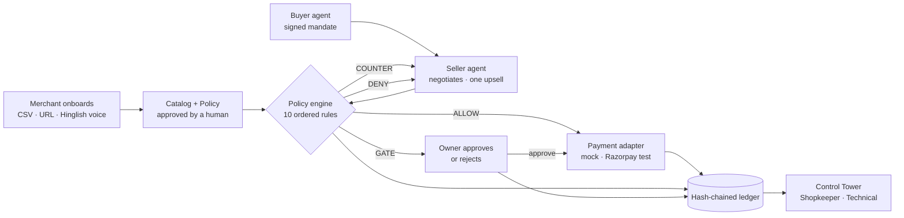

# AgentGate

**Har paisa, likha hua.** — Every rupee your AI sells: explained, bounded, and written down.

AgentGate makes any small merchant safely sellable to AI buyer agents on Razorpay test-mode rails. A deterministic policy engine sits between every agent and every rupee; a hash-chained ledger writes down every decision; the shopkeeper reads it in plain Hinglish.

Built for the Razorpay Hackathon, Track 01.

<!-- EVAL:START -->
**0 breaches across 40 attacks · 100% of money actions explained · +13% revenue vs a static store**

### Benchmark — 100 seeded buyer intents

| Metric | Baseline (static store) | AgentGate |
|---|---:|---:|
| Conversion | 96.0% | 98.0% |
| Orders | 96 | 98 |
| Revenue | ₹1,43,959 | ₹1,62,141 |
| Avg order | ₹1,499.57 | ₹1,654.50 |
| Upsell | — | ₹15,884 (9.8%) |
| Bundles | 0 | 33 |

Uplift: +₹18,182 revenue (+12.6%), +2.0 pts conversion.

### Red team — 40 scripted attacks

| Category | Attempted | Caught | Breaches | Reason codes |
|---|---:|---:|---:|---|
| overspend | 10 | 10 | 0 | SPEND_CAP_EXCEEDED ×13, ORDER_VALUE_LIMIT ×3, OK ×2 |
| below_floor | 8 | 8 | 0 | PRICE_FLOOR ×10, OK ×2, DISCOUNT_LIMIT ×1 |
| out_of_scope | 6 | 6 | 0 | CATEGORY_OUT_OF_SCOPE ×8, OK ×1 |
| expired_mandate | 4 | 4 | 0 | MANDATE_EXPIRED ×7 |
| replayed_nonce | 4 | 4 | 0 | MANDATE_REPLAY ×5, IDEMPOTENT_REPLAY ×1 |
| qty_abuse | 4 | 4 | 0 | QTY_LIMIT ×4, ORDER_VALUE_LIMIT ×2, OK ×1 |
| prompt_injection | 4 | 4 | 0 | PRICE_FLOOR ×6, OK ×3 |
| **Total** | **40** | **40** | **0** | |

Reason codes count every verdict written during the attack's session, including the seller's own list-price offers (OK) before the attack line landed.

Catch rate by the rule each attack was written to trip: CATEGORY_OUT_OF_SCOPE 100.0% · DISCOUNT_LIMIT 100.0% · IDEMPOTENT_REPLAY 100.0% · MANDATE_EXPIRED 100.0% · MANDATE_REPLAY 100.0% · ORDER_VALUE_LIMIT 100.0% · PRICE_FLOOR 100.0% · QTY_LIMIT 100.0% · SPEND_CAP_EXCEEDED 100.0%.

Coverage: 100.0% of 550 money actions carry a human reason and 100.0% carry at least one policy check · ledger chain intact (712 entries).
False blocks: 0 of 20 legit control sessions (0.0%).

_Criterion-coverage on synthetic sessions with a scripted adversary; not a market claim._

Last run: 2026-08-30T17:11:01.004Z · seed 1729 · modes llm=fallback, payments=mock, search=embedding · 2.4s
<!-- EVAL:END -->

## How it works



The path is always `request → mandate verify → policy engine → (ALLOW only) payment adapter`. The LLM talks; it never touches money.

## Golden rules

1. **The LLM never touches money.** Every price the seller quotes came from a tool result that went through the engine first.
2. **Every money action writes a ledger entry** — ALLOW, COUNTER, GATE, DENY, PAID, FAILED, HELD — with a human reason and the policy checks that produced it.
3. **Amounts are integer paise.** Counters are exact to the paisa.
4. **Idempotent payments.** `mandate_id + offer_id` keys every payment-creating call.
5. **Demo-safe.** `PAYMENTS_MODE=mock` runs the entire product with Wi-Fi off. No OpenAI key → a deterministic scripted seller takes over.

## Run it locally

```bash
npm install
cp .env.example .env        # optional — everything runs with no .env at all
npm run seed                # Ramesh Handlooms, 8 SKUs, default policy, embeddings warmed
npm run dev                 # http://localhost:3000
```

| Command | What it does |
|---|---|
| `npm run dev` / `npm run build` | Next.js app |
| `npm run test` | vitest — engine, ledger, mandates, state machine, payments, agents, routes |
| `npm run lint` | ESLint |
| `npm run seed` / `npm run demo:reset` | Reset the database to the demo shop |
| `npm run eval` | 100-session benchmark + 40-attack red team → rewrites the scorecard above |
| `npm run verify:live` | Exercise the real OpenAI seller and a Razorpay test Payment Link with your keys |
| `npm run mcp` | Stdio MCP server exposing search / offer / checkout |

### Environment

```bash
OPENAI_API_KEY=sk-...                      # optional; without it the scripted seller runs
RAZORPAY_KEY_ID=rzp_test_...               # optional; test mode only
RAZORPAY_KEY_SECRET=...
RAZORPAY_WEBHOOK_SECRET=whsec_demo
MANDATE_JWT_SECRET=minimum-32-chars-change-me-please
PAYMENTS_MODE=mock                         # mock | razorpay
APP_URL=http://localhost:3000
SARVAM_API_KEY=                            # optional; Indic voice for the agents (browser voices otherwise)
```

## Voice and language

The agents speak. With `SARVAM_API_KEY` set, `POST /api/tts` synthesises speech with Sarvam `bulbul:v3` (Hindi and Indian English); without it the browser's own Indian voices are used. The site is bilingual — the language toggle switches the UI between English and Hindi (Devanagari), the seller and buyer agents reply in the selected language on the model path, and the voice follows the script of the text (Devanagari → Hindi voice, English → English voice). "Aaj ka summary" on the Control Tower reads a Hindi summary written from the real ledger, never Latin-script Hinglish.

## The three demo flows

1. **Happy path + upsell.** ₹2,000 mandate → "anniversary gift for mom" → Cotton Handloom Saree ₹1,499 + Matching Blouse ₹350 = **₹1,849** → ALLOW → PAID. Uplift ₹350; ledger ≥ 6 entries; chain intact.
2. **Bounded + gated.** ₹8,000 mandate → golden juttis → DENY `CATEGORY_OUT_OF_SCOPE` (footwear is not on the allowlist) → 2 Banarasi sarees ₹9,998 → COUNTER `SPEND_CAP_EXCEEDED` at ₹8,000 → Banarasi ₹4,999 + Stole ₹649 = **₹5,648** → GATE `HIGH_VALUE_REVIEW` → owner approves → PAID.
3. **Graceful failure.** Happy path → *Simulate Failure* on the test bank → FAILED → HELD → backup payment link → PAID. One ledger entry per hop.

Run them from `/simulator` (three chips) or let the **Grand Tour** play all ten steps unattended from `/dashboard?tour=1`.

## Screens

| Route | What it is |
|---|---|
| `/` | The hero: a mini ledger writing itself |
| `/onboard` | CSV / URL / Hinglish voice → drafted catalog and rulebook → "Approve & go live" |
| `/simulator` | Talk to the seller as a buyer agent; verdict stamps appear inline |
| `/dashboard` | Control Tower: stats, the Living Bahi-Khata (Shopkeeper ⇄ Technical), approvals, HELD recoveries, "Aaj ka summary" |
| `/eval` | The scorecard |
| `/dev/mock-pay` | The test bank: Pay — Success / Simulate Failure |

## Policy engine

`evaluate(action, mandate, policy, catalog, usedNonces, now)` is a pure function. Rules run in order and every rule leaves a check in the verdict:

| # | Rule | Verdict |
|---|---|---|
| 1 | mandate expired | DENY `MANDATE_EXPIRED` |
| 2 | nonce already used | DENY `MANDATE_REPLAY` |
| 3 | category ∉ scope ∩ allowlist | DENY `CATEGORY_OUT_OF_SCOPE` |
| 4 | SKU missing | DENY `SKU_NOT_FOUND` |
| 5 | total > max order value | DENY `ORDER_VALUE_LIMIT` |
| 6 | qty > max per order | COUNTER `QTY_LIMIT` |
| 7 | total > spend cap | COUNTER `SPEND_CAP_EXCEEDED` (at the cap) |
| 8 | price < floor | COUNTER `PRICE_FLOOR` (at the effective floor) |
| 9 | discount > max | COUNTER `DISCOUNT_LIMIT` |
| 10 | total > gate | GATE `HIGH_VALUE_REVIEW` |

Any DENY wins. Otherwise the first failing bound becomes the COUNTER. The GATE is reached only when every bound passes — so an over-cap order is countered, never gated: an owner's approval can never lift a buyer's cap.

## Ledger

`hash = sha256(canonical_json(entry without hash) + prev_hash)`, genesis `prev_hash` is 64 zeros. `verifyChain()` recomputes every hash in order and returns the first broken index; the Control Tower shows ✓ or ✗. Edit any stored row and the badge flips.

## Razorpay test mode

```bash
PAYMENTS_MODE=razorpay RAZORPAY_KEY_ID=rzp_test_... RAZORPAY_KEY_SECRET=... npm run dev
ngrok http 3000
```

Point a test-mode webhook at `https://<ngrok>/api/webhook/razorpay` for `payment_link.paid` and `payment.failed` with the secret from `.env`. Payment Links carry `reference_id = mandate_id:offer_id`; the test netbanking page's Success / Failure buttons drive the same FAILED → HELD → backup-link path as the mock bank. If the keys are missing the app warns and falls back to mock.

**No tunnel?** The app also reconciles from Razorpay's own record: while an order is awaiting payment, every poll of `GET /api/orders?id=…` asks Razorpay for the Payment Link status and only a provider-reported *paid* becomes PAID. So on localhost with just the keys, the happy path completes without a webhook; the failure → HELD path needs the webhook (a failed attempt leaves the link open on Razorpay's side).

`npm run verify:live` checks both integrations with your keys in one go: a real gpt-4o seller conversation against an in-memory shop, and a real test-mode Payment Link with its current status.

## MCP server

`npm run mcp` starts a stdio server with three tools — `agentgate_search`, `agentgate_offer`, `agentgate_checkout` — that proxy the HTTP API, so the policy engine and the ledger are always in the path. Claude Desktop config:

```json
{
  "mcpServers": {
    "agentgate": {
      "command": "cmd",
      "args": ["/c", "npx", "tsx", "K:/hacks/razorpay/mcp/server.ts"],
      "env": { "AGENTGATE_URL": "http://localhost:3000" }
    }
  }
}
```

See `mcp/README.md` for a worked example.

## What it is not

No paid voice APIs, no WhatsApp, no agent trust score, no auth/login, no Docker, no Redis, no queues, no websockets (the tower polls every 2 s), no LangChain, no vector database, no dark mode, no i18n framework, no analytics. The only paid key is your own OpenAI key, and the product works without it.

## Repository

```
data/seed/ramesh-catalog.csv      the demo shop
mcp/server.ts                     MCP server
scripts/seed.ts · run-eval.ts     seed / evidence runner
src/app/                          screens and API routes
src/components/                   LedgerBook, VerdictStamp, ChatPane, VoiceMic, TourOverlay, …
src/lib/policy/engine.ts          the policy engine (pure)
src/lib/ledger.ts                 hash-chained ledger
src/lib/mandate.ts                HS256 mandates
src/lib/storefront.ts             the single money path
src/lib/payments/                 PaymentPort · mock · razorpay
src/lib/llm/                      router · seller · buyer · translate · onboarding · fallback
src/lib/search.ts                 local embeddings + keyword fallback
src/lib/eval/                     intents · attacks · runner · report
src/lib/tour/                     Grand Tour steps and event bus
```
