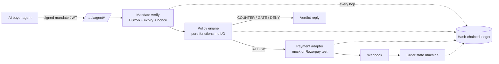

# Architecture

AgentGate makes a small Indian merchant safely sellable to AI buyer agents. The design has one non‑negotiable rule, and everything else follows from it:

> **The LLM never touches money.** Every money action travels `request → mandate verify → policy engine → (ALLOW only) payment adapter`, and every hop is written to a hash‑chained ledger — including denials and failures.

## The money path

The seller LLM negotiates, upsells and explains — but prices, discounts and availability come only from tool results, and the tools call the same policy engine. A prompt injection can change what the seller *says*, never what the engine *allows*.

## Modules

| Area | Where | Job |
|---|---|---|
| Onboarding | `src/app/onboard`, `/api/onboard` | URL / CSV / bill‑photo / Hinglish voice → catalog + draft policy → merchant approves |
| Agent storefront | `/api/agent/{discover,negotiate,checkout}` | discovery, negotiation and checkout for AI buyers |
| Policy engine | `src/lib/policy/engine.ts` | deterministic verdicts: ALLOW / COUNTER / GATE / DENY, most severe wins |
| Mandates | `src/lib/mandate.ts` | HS256 JWTs: spend cap, category scope, expiry, single‑use nonce |
| Seller agent | `src/lib/llm/seller.ts` | function‑calling negotiator, exactly one upsell, grounded shop‑info answers with citations |
| Payments | `src/lib/payments/{mock,razorpay}.ts` | one `PaymentPort`, two adapters; webhook verification; failure → HELD → fallback link |
| Orders | `src/lib/orders/stateMachine.ts` | `DRAFT → AWAITING_PAYMENT → PAID | FAILED`; `FAILED → HELD → AWAITING_PAYMENT`; `PENDING_APPROVAL → AWAITING_PAYMENT | REJECTED` |
| Ledger | `src/lib/ledger.ts` | append‑only, `hash = sha256(canonical_json + prev_hash)`, `verifyChain()` finds the first broken row |
| Control Tower | `src/app/dashboard` | live ledger feed, approval queue, KPIs, spoken day summary |
| Voice | `src/lib/voice/*`, `/api/tts`, `/api/stt` | Sarvam TTS/STT with browser fallbacks; consent‑gated mic; barge‑in |
| Evidence | `src/lib/eval/*`, `/eval` | 100‑intent benchmark + 40‑attack red team; breaches must be 0 |
| Metrics | `src/lib/metrics.ts`, `/metrics` | per‑request latency, tokens, tools, estimated cost |
| MCP server | `mcp/server.ts` | 3 stdio tools proxying the HTTP API — never bypassing policy |

## Policy engine

`evaluate(action, mandate, policy, catalog, usedNonces, now)` is a pure function — no I/O, no LLM, no `Date.now()` inside. Checks run most‑severe‑first (DENY > GATE > COUNTER):

1. mandate expired → DENY `MANDATE_EXPIRED`
2. nonce replayed → DENY `MANDATE_REPLAY`
3. category outside scope ∩ allowlist → DENY `CATEGORY_OUT_OF_SCOPE`
4. unknown SKU → DENY `SKU_NOT_FOUND`
5. total above the shop's max order value → DENY `ORDER_VALUE_LIMIT`
6. quantity above limit → COUNTER `QTY_LIMIT`
7. total above the mandate's spend cap → COUNTER `SPEND_CAP_EXCEEDED`
8. unit price below the floor → COUNTER `PRICE_FLOOR`
9. discount above the maximum → COUNTER `DISCOUNT_LIMIT`
10. total above the owner's gate threshold → GATE `HIGH_VALUE_REVIEW`
11. otherwise → ALLOW `OK`

Counters carry exact paise math; every verdict carries `reason_code`, a `human_reason`, and the full list of `policy_checks`.

## Ledger

Every money action — allowed, countered, gated, denied, failed — appends an entry. Each entry's hash covers its canonical JSON plus the previous hash; genesis uses 64 zeros. Tampering with any row breaks every hash after it, which the Control Tower surfaces as a red integrity badge with the broken index.

## Data & runtime

- **Next.js App Router** (TypeScript strict) serves UI and API from one process.
- **SQLite** (`better-sqlite3`, WAL) holds catalog, policy, sessions, orders, ledger, eval runs.
- **Embeddings**: MiniLM (`all-MiniLM-L6-v2`) runs locally for catalog search — no vector DB, in‑memory cosine.
- **zod** validates every boundary: API bodies, LLM output, webhooks.
- Amounts are **integer paise** end to end; `mandate_id + offer_id` is the idempotency key on payment creation.
- Shared server state (metrics ring buffer, rate‑limit windows) lives on `globalThis`, because Next bundles each route separately.
- `PAYMENTS_MODE=mock` runs the whole product offline; the scripted seller takes over automatically if the LLM is unreachable.
